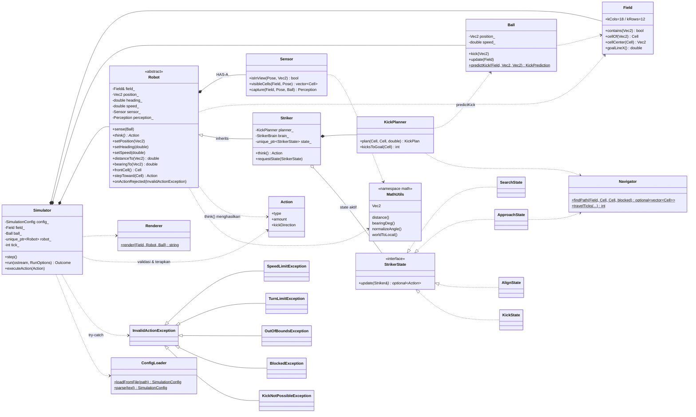
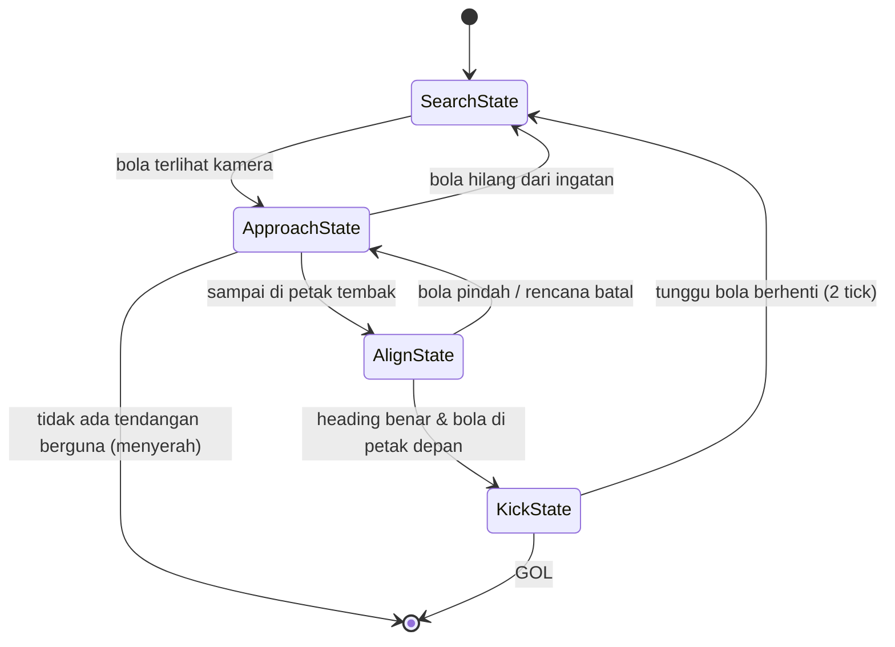

```mermaid
classDiagram
    direction LR

    class Simulator {
        -SimulationConfig config_
        -Field field_
        -Ball ball_
        -unique_ptr~Robot~ robot_
        -int tick_
        +step()
        +run(ostream, RunOptions) Outcome
        +executeAction(Action)
    }
    class Renderer {
        +render(Field, Robot, Ball)$ string
    }
    class ConfigLoader {
        +loadFromFile(path)$ SimulationConfig
        +parse(text)$ SimulationConfig
    }

    class Field {
        +kCols=18 / kRows=12
        +contains(Vec2) bool
        +cellOf(Vec2) Cell
        +cellCenter(Cell) Vec2
        +goalLineX() double
    }
    class Ball {
        -Vec2 position_
        -double speed_
        +kick(Vec2)
        +update(Field)
        +predictKick(Field, Vec2, Vec2)$ KickPrediction
    }

    class Robot {
        <<abstract>>
        -Field& field_
        -Vec2 position_
        -double heading_
        -double speed_
        -Sensor sensor_
        -Perception perception_
        +sense(Ball)
        +think()* Action
        +setPosition(Vec2)
        +setHeading(double)
        +setSpeed(double)
        +distanceTo(Vec2) double
        +bearingTo(Vec2) double
        +frontCell() Cell
        +stepToward(Cell) Action
        +onActionRejected(InvalidActionException)
    }
    class Striker {
        -KickPlanner planner_
        -StrikerBrain brain_
        -unique_ptr~StrikerState~ state_
        +think() Action
        +requestState(StrikerState)
    }
    class Sensor {
        +isInView(Pose, Vec2) bool
        +visibleCells(Field, Pose) vector~Cell~
        +capture(Field, Pose, Ball) Perception
    }

    class StrikerState {
        <<interface>>
        +update(Striker&)* optional~Action~
    }
    class SearchState
    class ApproachState
    class AlignState
    class KickState

    class KickPlanner {
        +plan(Cell, Cell, double) KickPlan
        +kicksToGoal(Cell) int
    }
    class Navigator {
        +findPath(Field, Cell, Cell, blocked)$ optional~vector~Cell~~
        +travelTicks(...)$ int
    }
    class MathUtils {
        <<namespace math>>
        Vec2
        distance()
        bearingDeg()
        normalizeAngle()
        worldToLocal()
    }

    class Action {
        +type
        +amount
        +kickDirection
    }
    class InvalidActionException
    class SpeedLimitException
    class TurnLimitException
    class OutOfBoundsException
    class BlockedException
    class KickNotPossibleException

    Simulator *-- Field
    Simulator *-- Ball
    Simulator *-- Robot
    Simulator ..> Renderer
    Robot *-- Sensor : HAS-A
    Robot ..> Field
    Robot <|-- Striker : inherits
    Striker *-- KickPlanner
    Striker o-- StrikerState : state aktif
    StrikerState <|.. SearchState
    StrikerState <|.. ApproachState
    StrikerState <|.. AlignState
    StrikerState <|.. KickState
    KickPlanner ..> Ball : predictKick
    KickPlanner ..> Navigator
    ApproachState ..> Navigator
    Robot ..> Action : think() menghasilkan
    Simulator ..> Action : validasi & terapkan
    InvalidActionException <|-- SpeedLimitException
    InvalidActionException <|-- TurnLimitException
    InvalidActionException <|-- OutOfBoundsException
    InvalidActionException <|-- BlockedException
    InvalidActionException <|-- KickNotPossibleException
    Simulator ..> InvalidActionException : try-catch
    Simulator ..> ConfigLoader
    Robot ..> MathUtils
    Sensor ..> MathUtils
    Ball ..> Field
```

## Diagram alur state Striker

```mermaid
stateDiagram-v2
    [*] --> SearchState
    SearchState --> ApproachState : bola terlihat kamera
    ApproachState --> SearchState : bola hilang dari ingatan
    ApproachState --> AlignState : sampai di petak tembak
    AlignState --> ApproachState : bola pindah / rencana batal
    AlignState --> KickState : heading benar & bola di petak depan
    KickState --> SearchState : tunggu bola berhenti (2 tick)
    ApproachState --> [*] : tidak ada tendangan berguna (menyerah)
    KickState --> [*] : GOL
```
